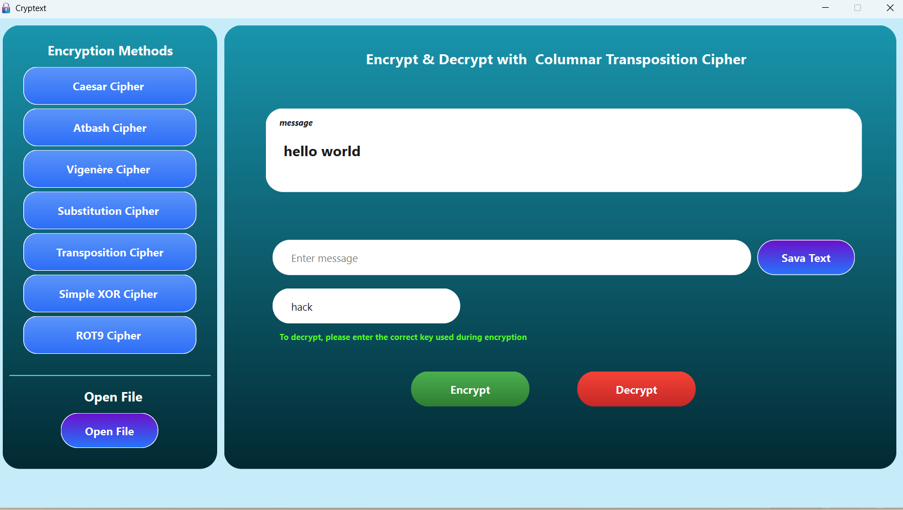

# CrypText 🛡️

[](https://isocpp.org/)  
[](https://www.qt.io/)  
[](LICENSE)

**CrypText** is a GUI-based desktop application for **text encryption and decryption** using classical ciphers. Built with **C++** and **Qt**, it demonstrates **OOP principles**: encapsulation, inheritance, polymorphism, and composition.

---

## Table of Contents

- [Features](#features)  
- [Supported Ciphers](#supported-ciphers)  
- [Installation](#installation)  
- [Usage](#usage)  
- [Example](#example)  
- [Requirements](#requirements)  
- [License](#license)  

---

## Features

- User-friendly GUI for text encryption and decryption.  
- Supports multiple classical ciphers and a bonus cipher.  
- Save/load plaintext, ciphertext, and substitution tables.  
- Input validation and error messages for invalid keys.  
- Modular design using a **Cipher** abstract base class.  
- Bonus Cipher: **ROT9** – shifts letters by 9 positions.  

---

## Supported Ciphers

### Substitution Ciphers
- **Caesar Cipher** – Numeric shift (e.g., shift 3 → A → D).  
- **Atbash Cipher** – Reverse alphabet mapping (A ↔ Z).  
- **Vigenère Cipher** – Polyalphabetic substitution using a keyword.  
- **Simple Substitution Cipher** – Full 26-letter key mapping (user-provided).  

### Transposition Cipher
- **Columnar Transposition Cipher** – Reorders columns using numeric or text key.  

### Bitwise Cipher
- **Simple XOR Cipher** – Bitwise XOR with numeric or single-character key.  

### Bonus Cipher
- **ROT9** – Rotates letters by 9 positions in the alphabet.  

---
## Screenshots

**Main GUI:**  


**Encryption Example:**  


**Decryption Example:**  


## Installation

1. Clone the repository:  
   ```bash
   git clone https://github.com/Prabod-Sandaruwan/CrypText.git
